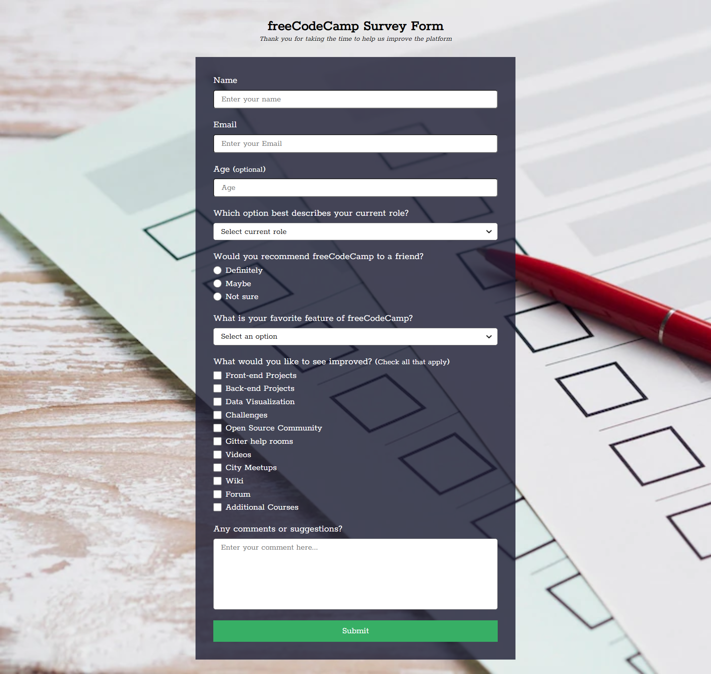

# freeCodeCamp - Build a Survey Form

This is a solution for the [Build a Survey Form project on freeCodeCamp Responsive Web Design](https://www.freecodecamp.org/). 

## Table of Contents

- [Overview](#overview)
    - [Screenshot](#screenshot)
    - [Links]()
- [My Process](#my-process)
    - [Built with](#built-with)
- [Author](#author)

## Overview

### Screenshot

**Desktop Design**

**Tablet Design**

**Mobile Design**

### Links

- Live Site URL: [Build a Survey Form](https://dwz-wong.github.io/freeCodeCamp-survey-form)

## My Process

### Built with

- HTML
- CSS

## Author

- freeCodeCamp - [@dwz_wong](https://www.freecodecamp.org/dwz_wong)
- Frontend Mentor - [@dwz-wong](https://www.frontendmentor.io/profile/dwz-wong)
- Twitter - [@dwz_wong](https://twitter.com/dwz_wong)
